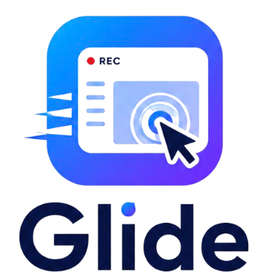
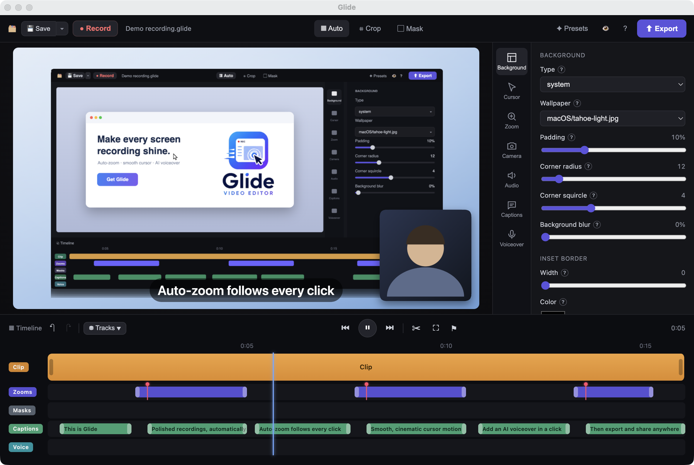
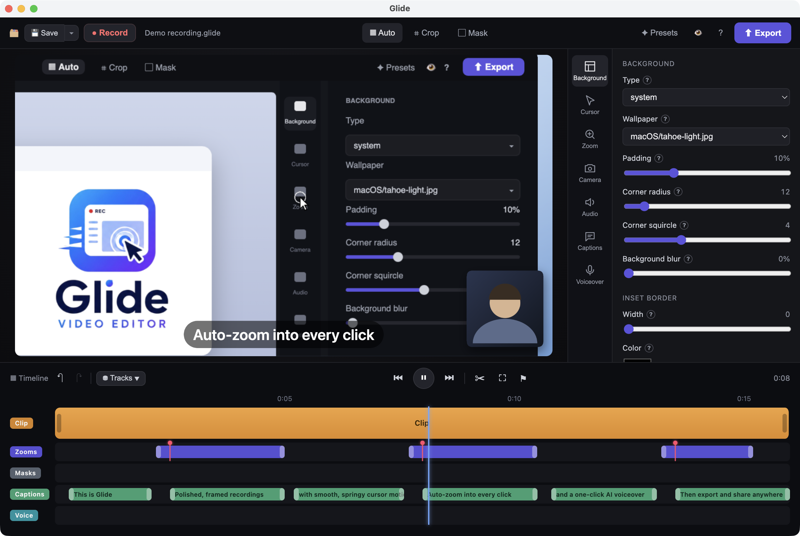
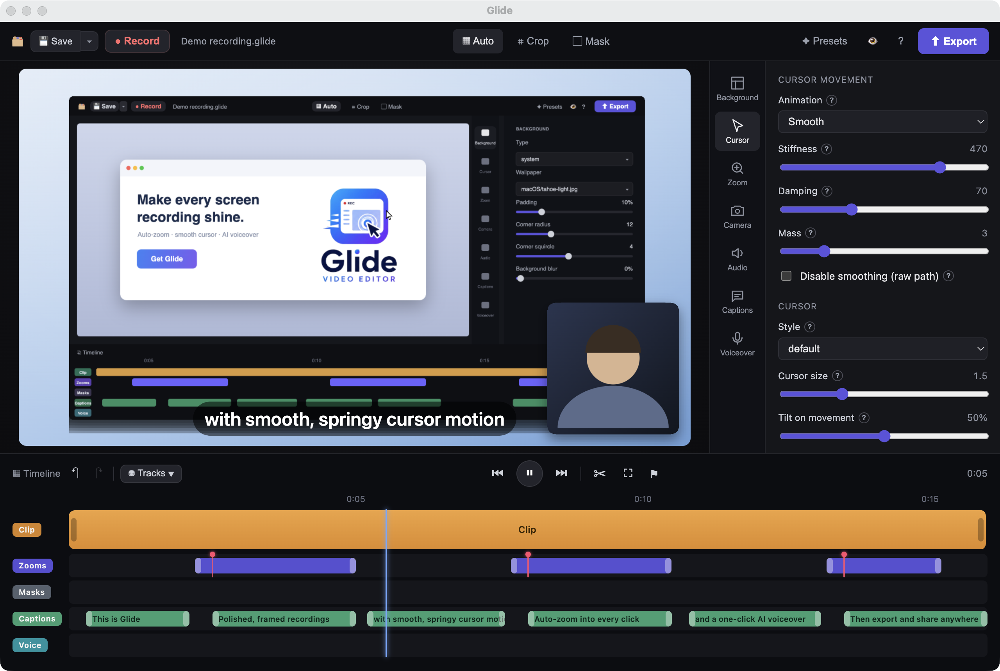
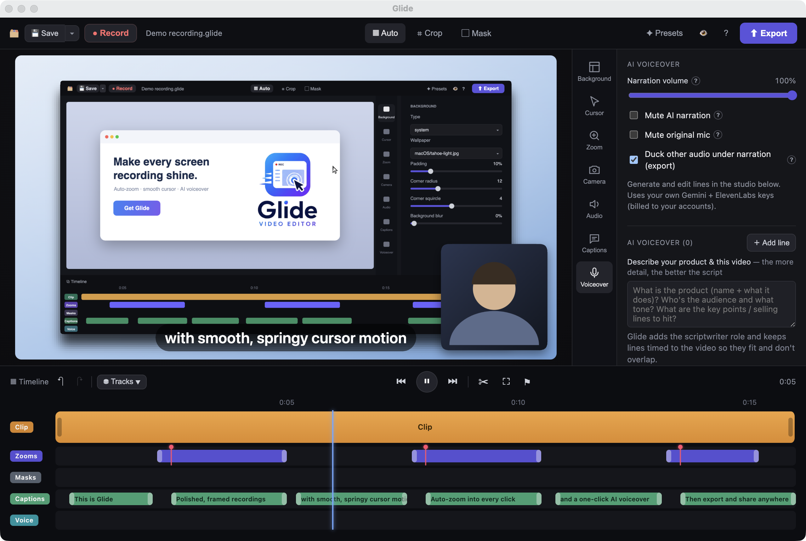

# Glide — Professional screen recorder for macOS

### Turn rough screen recordings into polished, share‑ready demos — automatically.

Auto‑zoom that follows your clicks · buttery cursor motion · cinematic backgrounds · captions · and an AI voiceover that writes *and* narrates your script.

**[⬇️ Download for macOS](https://github.com/manuaws2026-maker/Glide-Releases/releases/latest)**  ·  Apple Silicon  ·  Free

---

## Your screen recordings deserve better than “raw”

You hit record, click through your product, and stop. The result is shaky, zoomed‑out, and forgettable — the cursor darts around, nothing draws the eye, and there’s no voiceover.

**Glide fixes all of that in one pass.** Record your screen right inside Glide — it tracks your cursor and clicks as you go, then instantly adds smooth motion, zooms into every click, frames it on a beautiful background, and can even write and speak the narration for you. Tweak anything you like, then export a crisp MP4 or GIF.

No motion‑graphics skills. No fiddly keyframes. Just a recording that looks like a studio made it.

---

## What Glide does

### 🔍 Automatic zoom
Glide watches where you click and **zooms in on the action**, then glides back out — with natural, spring‑based motion. The rhythm of a hand‑edited demo, generated for you. Dial the zoom level and speed, or place zooms by hand.

### 🖱️ Buttery cursor motion
Real cursors are jittery. Glide replaces yours with a **smooth, weighted pointer** that eases between targets, with click ripples, adjustable size, and shake removal. Small detail, huge difference in polish.

### 🎙️ AI voiceover that writes your script
Describe your product in a sentence. Glide **watches your recording**, figures out who it’s for, and writes a natural, on‑brand voiceover — then speaks it in a lifelike voice and lines it up to the video so nothing overlaps. Don’t like a line? Edit it and re‑voice just that line.

### 🖼️ Cinematic backgrounds & framing
Wrap your recording in gradients, wallpapers, or solid colors, with adjustable padding, rounded (squircle) corners, shadow, and an inset border. Instantly turns a plain capture into something you’d put on a landing page.

### 📹 Webcam overlay
Add a picture‑in‑picture camera bubble — round or rounded‑square, repositionable, with a subtle scale‑down during zooms so it never blocks the action.

### 💬 Captions
Auto‑transcribed captions you can style and edit — great for silent autoplay on social.

### 🔊 Audio & music
Mic + system audio, optional voice clean‑up, and background music that **automatically ducks** under narration. Add click sounds for extra feedback.

### 🎞️ Motion blur
A touch of cinematic blur on fast cursor moves and zooms, so motion feels smooth instead of snappy.

### ✂️ A real timeline
Trim, cut, change speed, and arrange zoom / caption / voice tracks — everything stays in sync.

### 📤 One‑click export
Render a sharp **MP4**, an **animated GIF**, or **WebM**, with quality presets and embedded chapters.

---

## Get started in 60 seconds

1. **Record** your screen (and camera, if you like) right inside Glide — or reopen a saved Glide project.
2. **Watch Glide polish it** — auto‑zoom, smooth cursor, and a framed background, applied automatically.
3. **Add a voiceover** — describe your product and let Glide write and speak it, or record your own.
4. **Tweak & export** — adjust anything on the timeline, then export an MP4 or GIF to share anywhere.

📖 **[Read the docs →](docs/getting-started.md)**

---

## Install

1. **[Download the latest `.dmg`](https://github.com/manuaws2026-maker/Glide-Releases/releases/latest)**
2. Open it and drag **Glide** into **Applications**.
3. Launch Glide. On first use, macOS will ask for Screen Recording (and, if you record them, Camera/Microphone) permission — grant it in **System Settings → Privacy & Security**.

**Requirements:** macOS 12+ on Apple Silicon.

The AI voiceover is optional and uses your own API keys, kept encrypted on your Mac — see the **[FAQ](docs/faq.md)**.

---

## Docs

- **[Getting started](docs/getting-started.md)** — record, polish, export
- **[Features in depth](docs/features.md)** — every panel and setting
- **[FAQ](docs/faq.md)** — permissions, AI keys, export, troubleshooting

---

**[⬇️ Download Glide for macOS](https://github.com/manuaws2026-maker/Glide-Releases/releases/latest)**

Make every screen recording shine.

